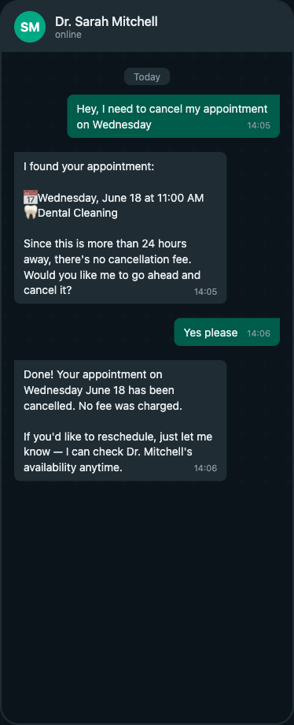

<h1 align="center">WhatsApp AI Receptionist</h1>

**Your clients are messaging you on WhatsApp anyway. This bot answers them.**

Service businesses -- dentists, nutritionists, physiotherapists, salons -- lose bookings because nobody picks up the phone at 11pm. Clients message on WhatsApp, get no reply, and book elsewhere. The AI receptionist handles the conversation, checks real-time availability, and books directly into Google Calendar. No app to install, no portal to learn. Just WhatsApp.


---

## What it does

| Capability | How |
|---|---|
| **Conversational booking** | Natural language via WhatsApp, powered by Claude |
| **Real-time availability** | Google Calendar integration with slot locking |
| **Full lifecycle** | Create, cancel, and modify appointments |
| **Voice messages** | Audio transcribed via OpenAI Whisper |
| **Smart dates** | "tomorrow", "next Wednesday", "next week" resolved to real dates |
| **Reminders** | Automated WhatsApp messages 24h before appointments |
| **Payments** | Optional Mercado Pago integration with checkout links |
| **Multi-client ready** | YAML config + knowledge base per business, no code changes |
| **Resilient state** | Redis in production, in-memory fallback for development |

---

## Screenshots

### Booking flow
A client books a dental cleaning in natural language. The bot checks real-time availability, presents open slots, and confirms the appointment in Google Calendar.


### Cancellation flow
The bot finds the existing appointment, checks the cancellation policy (24h rule), and cancels with no fee.



---

## How it works

```
Client sends WhatsApp message
        │
        ▼
┌─────────────────┐
│  FastAPI webhook │ ◄── validates HMAC signature
└────────┬────────┘
         │
         ▼
┌─────────────────┐     ┌──────────────┐
│   Claude AI     │ ◄───│  Knowledge   │
│  (conversation) │     │  base + config│
└────────┬────────┘     └──────────────┘
         │
         │ extracts structured intent
         ▼
   ┌─────┴──────┐
   │            │
   ▼            ▼
┌──────┐  ┌──────────┐
│ Book │  │ Cancel/  │
│      │  │ Modify   │
└──┬───┘  └────┬─────┘
   │           │
   ▼           ▼
┌─────────────────┐
│ Google Calendar  │ ◄── real-time availability check
└────────┬────────┘
         │
         ▼
   Confirmation via WhatsApp
```

---

## Quick start

### 1. Clone and install

```bash
git clone https://github.com/martin-minghetti/whatsapp-ai-receptionist.git
cd whatsapp-ai-receptionist
python -m venv venv
source venv/bin/activate
pip install -r requirements.txt
```

### 2. Configure

```bash
cp .env.example .env
# Edit .env with your API keys
```

### 3. Run

```bash
uvicorn core.main:app --reload
```

### 4. Expose for WhatsApp

Use [ngrok](https://ngrok.com/) for local development:

```bash
ngrok http 8000
```

Set the webhook URL in [Meta Developer Portal](https://developers.facebook.com/) -> WhatsApp -> Configuration:
- Callback URL: `https://your-ngrok-url.ngrok.io/webhook`
- Verify token: same as your `WHATSAPP_VERIFY_TOKEN`

## License

MIT
